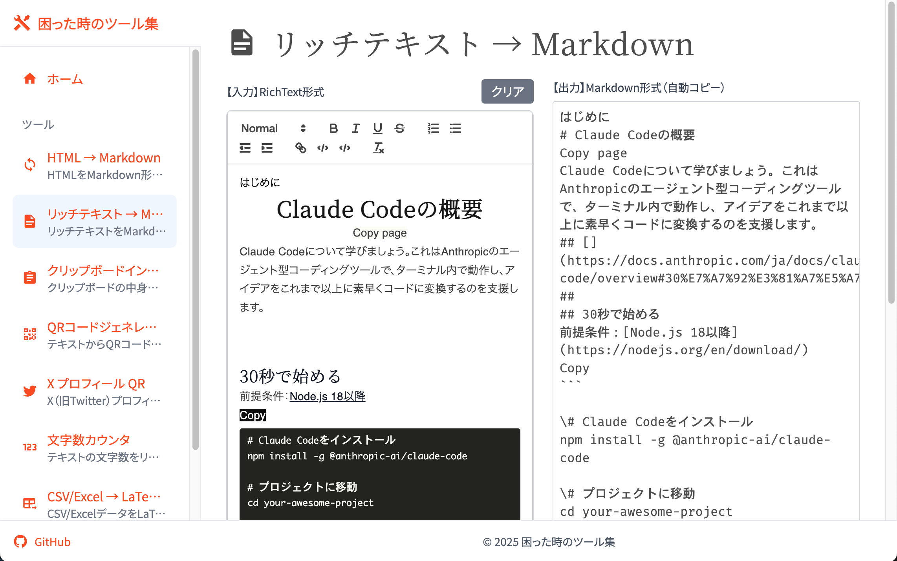

<!-- _class: cover -->
<!-- _paginate: false -->

# AIコーディングAgentとの向き合い方

2025年8月27日 AIコーディングAgent活用LT会

---

## 自己紹介

kmuto

 

株式会社Citadel AI
　AIの評価を行うスタートアップ
趣味は環境構築と作業効率化

本日の資料を公開中➡️

@eycjur

<a href="https://gihyo.jp/book/2025/978-4-297-15100-3">#指南書本</a>
技術評論社 8/27発売

---

<!-- _class: toc -->

## 今日お伝えする3つのプラクティス

1. まず使え＆最初は便利ツールから
2. AIが得意なタスクに分解する
3. AIコーディングAgentが自律的に得意なタスクに分解する

---

<!-- _class: full_screen -->

# <!--fit--> AIコーディングAgent使ってますか？

---

## 🚨 最大のリスクはAIを使わないこと

#### AIは想像以上に進化する
- まだ完全自動での開発は無理
- でも、**開発速度は確実に向上**
- 近い将来、**AIコーディングが標準に**

#### まずは使うことから始めよう
エンジニアはAIに置き換わらないと断言できますか？

<!-- 今はそうじゃないけど、近い将来 -->

---

<!-- _class: section_title -->

## プラクティス #1: まず使え＆最初は便利ツールから

---

<!-- _class: leading-tight -->

## 💡 便利webツールは入門に最適

#### なぜ便利ツールが最適なのか？
- **1機能1ファイル**で完結 → コンテキストの把握が容易
- **ブラウザで即座**に動作確認可能 → 成否が明確、価値が明示的

→ **AIコーディングAgentが最も得意**とするタスクで成功体験を積む

#### 具体例
- 文字数カウンタ
- QRコード生成ツール
- テキスト変換ユーティリティ

**💪 ポイント**: 最初は **「自分が使いたい」ツール** から始める！

---

## 実例： コピペした文章をMarkdownに変換するツール

https://eycjur.github.io/helpful_tools/tools/richtext-to-markdown

---

<!-- _class: full_screen -->

# <!--fit--> でも、AIコーディングってデモアプリしか作れないんじゃ？

---

<!-- _class: section_title -->

## プラクティス #2: AIが得意なタスクに分解する

---

## 📊 AIコーディングAgentの得意と不得意

### AIが得意なタスク

✅ **答えが一意**に定まる質問
✅ **前提条件が明確**な質問
✅ **期待値が明示的**な場合
✅ **コンテキスト（見るべき情報）が明確**な場合

### AIが苦手なタスク

❌ **答えが複数**に分かれる質問
❌ **前提条件が曖昧**な質問
❌ **暗黙の期待値**がある場合
❌ **コンテキストが大きい**場合

→現在のAIコーディングでは、AIが答えやすいように質問を設計するスキルが重要

---

<!-- _class: leading-snug -->

## 実践例：OSSコントリビュートでの成果

#### 🐛 LiteLLMバグ分析：「答えが一意」の威力

**答えが一意に定まる質問**：
> 「以下のコードを実行した時に、呼ばれる関数を順番に教えて」

**Claude Codeの回答**：

1. `encode(model="gpt-3.5-turbo", text="Hellö World...")`
2. `_select_tokenizer(model="gpt-3.5-turbo")`
3. `_return_openai_tokenizer()`
4. `tiktoken cl100k_base encoding.encode()`

---

<!-- _class: leading-snug -->

## 実践例：OSSコントリビュートでの成果

#### 🐛 LiteLLMバグ分析：コンテキストを明示した上で質問

**呼ばれる関数を順番をコンテキストに入れた上での質問**：
> このフローの中で、何かおかしい部分はありますか？

**Claude Codeの回答**：

> 設計上の問題: encode/decode は適切なモデル固有処理をしていない

 

**結果**：問題の根本原因を特定

---

<!-- _class: leading-snug -->

## 実践例：OSSコントリビュートでの成果

#### 🚨 ただし、実装は難しい

**依存関係の把握が困難**
循環インポート（ファイル間の依存関係が逆）になるコードを追加
→ 人間が依存関係の整理を指示する必要がある

**既存のコードベースへの理解不足**
既存ファイルに類似のロジックがあるにも関わらず新しいファイルにロジックを追加
→ 人間が既存ファイルとの関連性を指摘し、コードの統合を指示

**結果**：PR作成までをAIコーディングAgentに任せることは不可能

---

<!-- _class: full_screen -->

# <!--fit--> では、プロダクションでの活用方法は？

---

<!-- _class: section_title -->

## プラクティス #3: AIコーディングAgentが自律的に得意なタスクに分解する

---

<!-- _class: leading-tight -->

## 🛠️ テスト駆動開発

#### そもそもテスト駆動開発とは？

テストコードを先に書き、そのテストをパスするように実装コードを書く開発手法

1. テストリストを作成する
2. リストから1つ選び、失敗するテストを書く
3. テストを通す最小の実装を書く
4. リファクタリングを行う
5. 1に戻る

---

<!-- _class: leading-snug -->

## 🛠️ テスト駆動開発

#### AIコーディングAgentとテスト駆動開発の相性が良い理由

- テストコードを書く際に**仕様が明確化**される
  - 実装前に前提条件と期待値が明示化される
- **1つのタスクに集中**できる
  - コンテキストが小さく、AIが答えやすい
- **リファクタリング**により品質が向上する
  - AIが苦手な大規模コードベースにおける課題を解決できる

AIが得意なタスクにAI自身が分解し、実装する方法と見なすことができる

---

<!-- _class: leading-tight -->

## 🤖 AIによる自己改善開発

### 🔮 **未来のビジョン**
いつまでAIに指示を出す必要があるのか？

⬇️ 私の考え

**AIコーディングAgentが自律的に得意なタスクに分解する方法を習得する**ようになるだろう

### ⚡ **現在挑戦中の取り組み**

**🎯 タスク評価システム**
- AIが各タスクを行った後、その結果を評価
- 成功・失敗パターンを学習

**🧠 フィードバック学習**
- そのフィードバックに基づき、AIが良いやり方自体を習得

AIを**ただ使う**だけでなく、AIが**自律的に成長する仕組み**を作ろう！

---

<!-- _class: leading-tight -->

## 🎯 3つのプラクティスまとめ

### 1️⃣ **まず使え＆最初は便利ツールから**
- AIコーディングAgentを使い始める
- 1機能1ファイルの便利webツールから始める

### 2️⃣ **AIが得意なタスクに分解する**
- 答えが一意に定まる質問を設計する
- 前提条件・期待値を明確にする

### 3️⃣ **AIが自律的にタスク分解する未来**
- AIの成功・失敗パターンを分析し自律的に成長する

---

<!-- _class: leading-none -->

## 📚 参考：Claude Codeを使うための参考資料

- [Claude Codeの公式ドキュメント](https://docs.anthropic.com/ja/docs/claude-code/overview)
  - 日本語で解説されており、説明も丁寧なので、一回全部読んでみると良い
- [SuperClaude Framework](https://github.com/SuperClaude-Org/SuperClaude_Framework)
  - AgentやMCPなどのプリセット。何も考えずにとりあえずいい感じのものを使いたい人におすすめ
- [Awesome Claude Code](https://github.com/hesreallyhim/awesome-claude-code)
  - Claude Codeの情報がまとまっているリポジトリ。
- [Claude Code のすすめ](https://speakerdeck.com/schroneko/getting-started-with-claude-code)
  - コマンドやmcpサーバーの設定など、Claude Codeの基本的な使い方がまとまっている

---

<!-- _class: back_cover -->

## Thank you!
