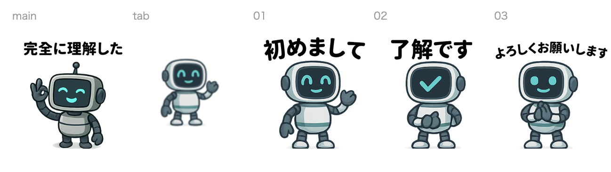
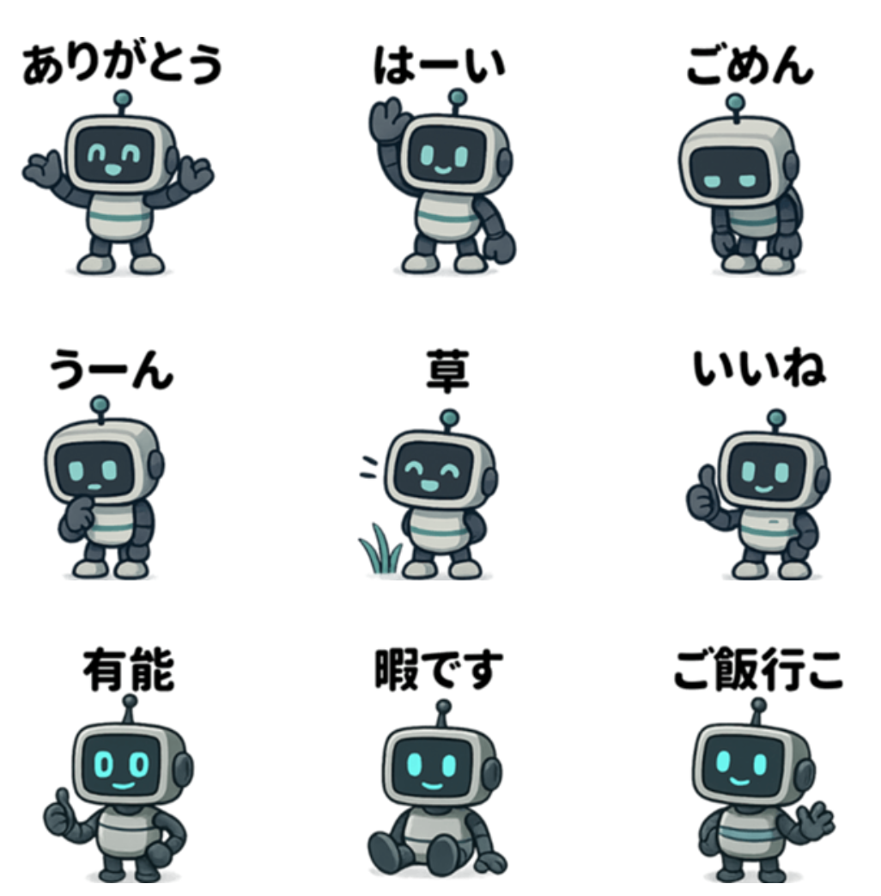
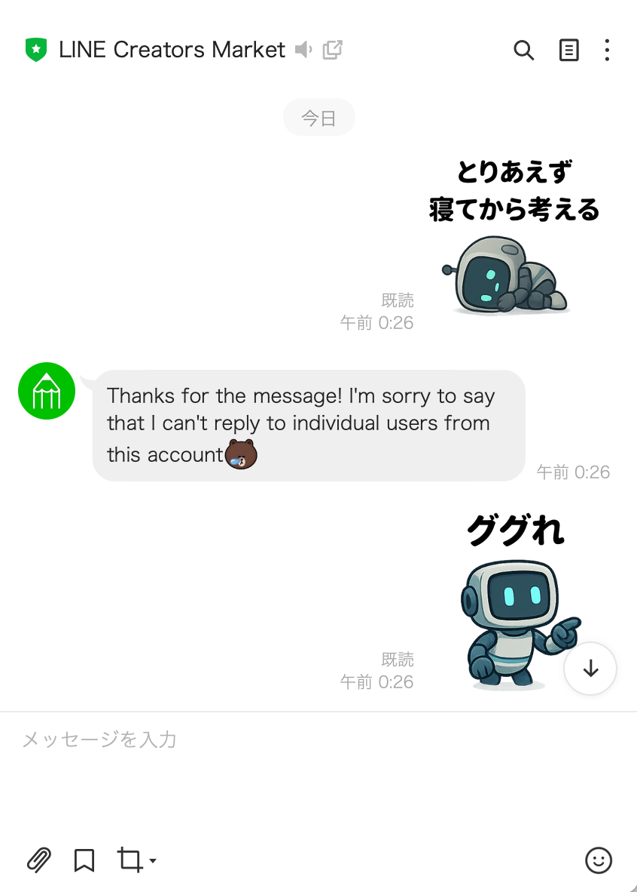

<!-- _class: cover -->
# AIでLINEスタンプを作ってみた

##### ChatGPTとPythonで画像生成からLINEスタンプ登録まで

kmuto

---

<style scoped>
.sns-icon {
  position: absolute;
  top: 150px;
  right: 850px;

  img {
  border-radius: 50%;
  }
}
.sns-qrcode {
  position: absolute;
  top: 490px;
  right: 650px;
}
</style>

## 自己紹介

<div class="column">
<div>

<p class="text-2xl">kmuto</p>

<br>

株式会社Citadel AI
　AIの評価を行うスタートアップ
趣味は環境構築と作業効率化

<p>本日の資料を公開中➡️</p>
@eycjur

</div>
<div class="center">


<a href="https://gihyo.jp/book/2025/978-4-297-15100-3">#指南書本</a>
技術評論社 8/27発売

</div>
</div>

<div class="sns-icon">


</div>

<div class="sns-qrcode">


</div>

---

<!-- _class: toc -->
# アジェンダ

1. 作成の動機
2. 作成・登録手順
3. 今後の改善点

---

<!-- _class: section_title -->
## 作成の動機

---

# いいスタンプがない

- 「いいね」「なるほど」みたいなちょうどいいスタンプがない
- 初対面の人や少し距離のある人に気軽に送れるスタンプがない
- エンジニアっぽいスタンプが少ない

➡️ 生成AIでイラスト生成が素人でもできるようになったので、自分でやってみよう！

---

<!-- _class: section_title -->
## 作成・登録手順

---

# ワークフロー

1. よく使う表現をピックアップ
2. ChatGPTでベースとなるキャラクターを作成
3. 各表現に対する画像を生成
4. 文字を追加
5. 登録処理

---

## Step 1: よく使う表現をピックアップ

自分の過去の会話履歴を見直して、いくつかのジャンルに分けてよく使う表現を選定

<div class="column-3">
<div>

### 軽い敬語表現
- 了解です
- 助かります

</div>
<div>

### いい感じの表現
- いいね
- なるほど
- はーい

</div>
<div>

### エンジニア表現
- 完全に理解した
- 仕様です
- WIP

</div>
</div>

---

<style scoped>
.code-kun {
  position: absolute;
  top: 350px;
  right: 50px;
  background: white;
}
</style>

## Step 2: キャラクター作成

1. ChatGPTと壁打ちしながらコンセプトを決定  
   → エンジニアっぽい**ロボットキャラクター「コードくん」** に決定

2. ChatGPTで試行錯誤しながら画像を作成

3. 安定して同じキャラクターが生成できるように  
   **キャラクターの特徴を詳述したプロンプトを作成**

```
## 1. 頭部（モニターヘッド）
* 形状：横長の角丸長方形
  * 幅：約200 px、高さ：約130 px
  * 角丸半径：約30 px
* 内部スクリーン：濃いブルーグレーの長方形
```

<div class="code-kun">


</div>

---

## Step 3: 各表現に対するプロンプトを作成

画像を安定させるため、以下のプロンプトで**3×3の画像を生成**  
（1枚ずつ生成させると統一感がなくなる）

```
以下条件に従ってコードくんlineスタンプを作成して

# 条件
- コードくんのデザインに従うこと
- 縦3個横3個並べる形で1枚に9個のスタンプを同時に生成すること
- 全体の画像サイズは、1024 * 1024とする
- 背景を透過したPNG形式とすること
- 文字は入れないこと
```

---

## Step 4: 文字を追加

**1. Python処理**  
生成した画像を分割・余白の追加を行う

**2. Canvaでテキスト追加**  
袋文字（アウトライン付きテキスト）を追加  
➡️ ダークモードでも見やすいように**黒文字＋白縁取り（袋文字）** に

<div class="center">


</div>

---

## Step 5: 登録処理

**LINE Creators Market**での登録処理

- 公式の手順に従って登録するだけ
  - https://linecreator-manual-ja.blog.jp/archives/5655078.html
- ただし、zipでのアップロード時は**ファイル名が規定に従っている必要**があり、Pythonでリネームを実施

<div class="center">



</div>

---

## 完成したスタンプ

<div class="column">

<div class="center">



</div>
<div class="center">



</div>
</div>

**販売URL**: https://store.line.me/stickershop/product/31400101/ja

---

<!-- _class: section_title -->

## 今後の改善点

---

## 現在の課題

#### 画像クロップの改善
- 生成した画像を分割・余白の追加は完全自動化できていないので、改修したい

#### 品質向上
- 画像サイズを最大にする
  - 画像サイズが小さいとLINEアプリ内でも小さく表示される

---

<!-- _class: back_cover -->
# ありがとうございました

もしよろしければ、こちらからご覧ください

<div class="column">
<div class="center">


**LINE STORE URL**

</div>
<div class="center">


**GitHubリポジトリURL**

</div>
</div>
