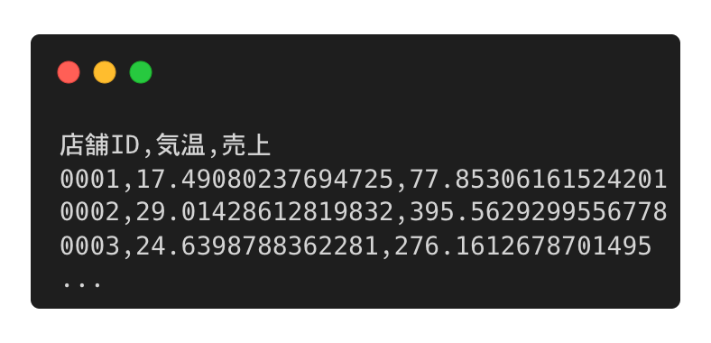
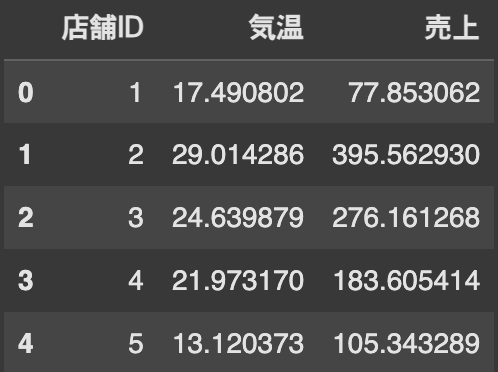
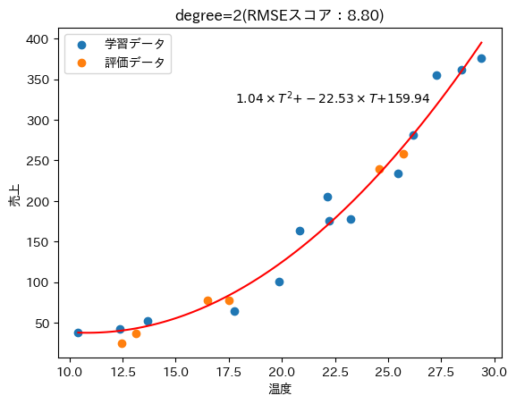
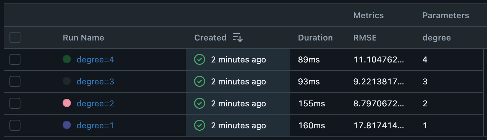

<!-- _class: cover -->
<!-- _paginate: false -->

# 理論と実務のギャップを超える
## 〜機械学習(生成AI)導入の実践知〜

2025年10月11日 情報科学若手の会
武藤 克大（kmuto）

---

<style scoped>
.sns-icon {
  position: absolute;
  top: 150px;
  right: 600px;

  img {
  border-radius: 50%;
  }
}
.colab-qrcode {
  position: absolute;
  top: 530px;
  right: 600px;
}
</style>

## 自己紹介

<div class="column">
<div>

<p class="text-2xl">武藤克大(kmuto)</p>

<div class="space-base"></div>

株式会社Citadel AI
　AIの評価を行うスタートアップ
OSS contributor
趣味は環境構築と作業効率化

<div class="space-sm"></div>

<p>ハンズオン資料を公開中➡️</p>

</div>
<div class="center">


<a href="https://gihyo.jp/book/2025/978-4-297-15100-3">#指南書本</a>
技術評論社 8/27発売

</div>
</div>

<div class="sns-icon">


</div>

<div class="colab-qrcode">


</div>

---

<!-- _class: leading-tight -->

## 本日話したいこと

<div class="column">
<div>

<div class="center">
理論

<div class="space-sm"></div>


大学/研究で必要なこと

</div>

</div>
<div>

<div class="center">
実務

<div class="space-sm"></div>


社会実装する際に必要なこと

</div>

</div>
</div>

<div class="center">

<div class="text-xl">

**機械学習(生成AI)におけるこのギャップを埋めるには？**

</div>

<div class="text-xs">

※技術的に難しい話ではなく、実務で直面する落とし穴を紹介します

</div>

</div>

---

## どういうギャップがあるのか

<div class="column">
<div>

### 📚 理論で学ぶこと

- 機械学習モデルのアルゴリズム
- 統計学の知識
- 精度が高いモデル
- 整備されたベンチマークで評価

</div>
<div>

### 💼 実務で求められること

- 再現性・保守性の高いモデル
- 汚いデータの前処理
- 運用を見据えたコード品質
- チームでの共同開発

</div>
</div>

<div class="center">

**重視される価値が異なる**

</div>

---

<!-- _class: leading-snug -->

## これまでの乗り越え方と課題

<div class="column">
<div>

### 従来の方法
- 実務で試行錯誤しながら習得
- 2~3年かけて徐々に身につける
- 実PJでの「ぶつかり稽古」

</div>
<div>

### 課題
- 非効率的な学習プロセス
- 体系的な知識が得られない
- 同じ失敗を繰り返す

</div>
</div>

### 💡 本発表のアプローチ

実務でよくある「落とし穴」を事前に知り、効率的に学ぶ
→ 今日は具体例を通じて、その一端を体験してもらいます

---

<!-- _class: leading-snug -->

## 💻 機械学習プロジェクトのフロー

<div class="center">

1. 要件定義 → 2. PoC（モデル開発） → 3. 本番運用

</div>

### 1. 要件定義
ビジネス課題を整理し、機械学習で解決できるか検討

### 2. PoC（モデル開発）
モデルを開発し、課題を解決できるか、精度の検証を行う

### 3. 本番運用
開発したモデルを実際のシステムに組み込み運用

---

<style scoped>
img {
  position: absolute;
  top: 400px;
  right: 200px;

  img {
  border-radius: 50%;
  }
}
</style>

<!-- _class: leading-tight -->

## 要件定義（今回のシナリオ）

### 📋 ビジネス課題
A商店は5店舗を展開するアイスクリーム販売店。各店舗の発注量を最適化したい。

### 🎯 解決したいこと
- 店舗ごとの売上予測モデルを作成
- 特に気温による影響を定量化したい

### 📊 利用可能なデータ
- 過去の販売実績（店舗別）
- その時の気温データ

<div class="center">


</div>

---

## PoC（モデル開発）のスタート

### 📁 提供されたデータ
アイスクリームの過去の販売実績と気温データ（CSV形式）

<div class="center">



</div>

---

## まずはデータを読み込んでみよう

### 📖 教科書的なコード

```python
import pandas as pd

# CSVファイルを読み込む
df = pd.read_csv("sales_data.csv")
print(df.head())
```

<div class="center text-lg">

**これで問題なく動くはず...？**

</div>

---

<!-- _class: leading-tight -->

## 実務における落とし穴1：文字コードの違い

### ❌ エラーが発生

```
UnicodeDecodeError: 'utf-8' codec can't decode byte
0x93 in position 0: invalid start byte
```

### 🔍 原因
- Windows(Excel)で作成されたCSVは **CP932（Shift_JISの拡張）** でエンコード
- Pandasのデフォルトは **UTF-8**

### ✅ 解決策

```python
df = pd.read_csv("sales_data.csv", encoding="cp932")
```

---

<!-- _class: leading-tight -->

## 実務における落とし穴2：データ型の自動推論

### ❌ 問題：店舗IDの先頭の0が消える

<div class="center">



</div>

### 🔍 原因
- Pandasが店舗ID「001」「002」を **整数型と自動推論**

### ✅ 解決策：明示的にデータ型を指定

```python
df = pd.read_csv("sales_data.csv", dtype={"店舗ID": str},  encoding="cp932")
```

---

<!-- _class: auto-fit -->

## 機械学習モデルを作ってみよう

### 📊 多項式回帰モデルを採用

気温と販売数の関係を多項式でモデル化

$$
y = a_N T^N + a_{N-1} T^{N-1} + ... + a_1 T + a_0
$$

<div class="text-xs">

- $y$: 販売数（予測したい値）
- $T$: 気温（説明変数）
- $N$: 多項式の次数（ハイパーパラメータ）
- $a_0, a_1, ..., a_N$: 回帰係数（学習で求める）

</div>

### 🎯 やること
複数の次数 $N$ で学習し、最も性能が良いモデルを選ぶ

---

## 実験結果：最適な次数を探索

<div class="center">



</div>

### 📊 結果
- **次数2のモデル**が最もRMSE（誤差）が小さい
- これをベストモデルとして採用

---

<!-- _class: auto-fit -->

## 実務における落とし穴3：実験の再現性

### ❌ 問題：うまくいったモデルが再現できない

実験を繰り返していると...
- 各パラメータでの実験結果を忘れる
- 「最も性能が良かった実験」の条件がわからなくなる

### ✅ 解決策：実験管理ツール（MLflow）を使う

<div class="column">
<div>

#### 自動記録される情報
- パラメータ（次数、学習率など）
- メトリクス（RMSE、精度など）
- モデルファイル

</div>
<div>



</div>
</div>

→ 過去の全実験が記録され、いつでも再現可能

---

<!-- _class: full_screen -->

<div class="center">

# 最強モデルを再現できて完璧！

</div>

---

<!-- _class: full_screen -->

<div class="center">

# いい感じで本番運用しといて

</div>

❌ このNotebook(colab)動かないんだけど
❌ このライブラリ、最新版だとエラー出るんだけど
❌ 次数って何？毎回最適値を探すの？

---

<!-- _class: leading-snug -->

## 実務における落とし穴4：Notebookの限界

### 📓 Notebookの利点と課題

<div class="column">
<div>

#### ✅ 利点
- 試行錯誤しやすい
- 可視化が簡単
- 学習・実験に最適

</div>
<div>

#### ❌ 本番運用での課題
- セルの実行順序に依存する
- ライブラリのバージョンが不明
- 実験コードと本番コードが混在

</div>
</div>

### ✅ 解決策

**本番運用を見据えた開発では`.py`スクリプトを使う**

---

## まとめ：理論と実務のギャップを超えるために

- 理論で学ぶことと実務で求められることは **異なる**
- 今日紹介した落とし穴は **あくまで一例**
- これらの知見を **体系化・共有** することが業界全体の成長に繋がる
- **機械学習以外の領域** でも同じような落とし穴はあるハズ
- **知の高速道路** が整備されていき、業界全体の発展につながるといいなと思っています
- **研究やOSS開発以外の社会貢献方法** としても面白いのでは？

---

<!-- _class: back_cover -->

## Thank you!
