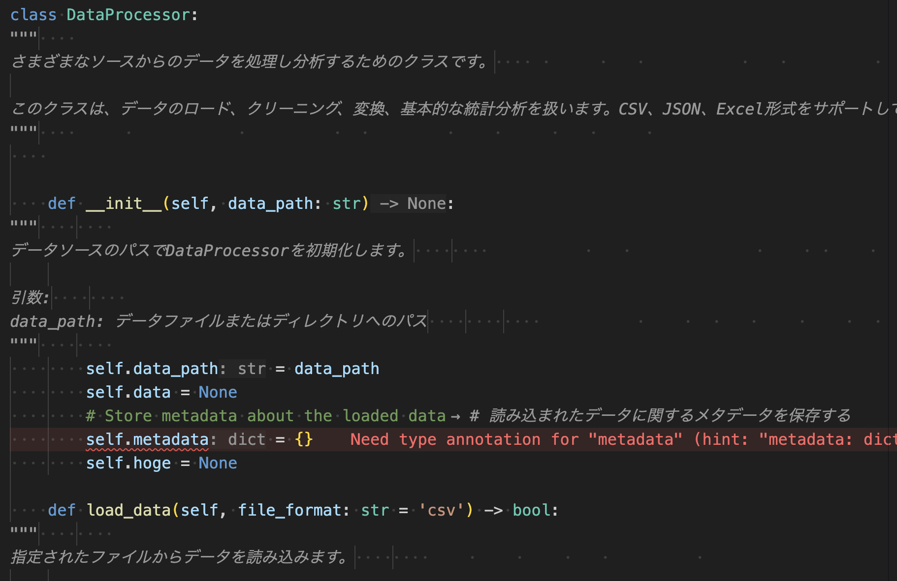
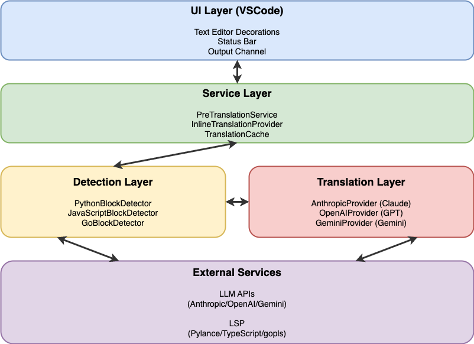
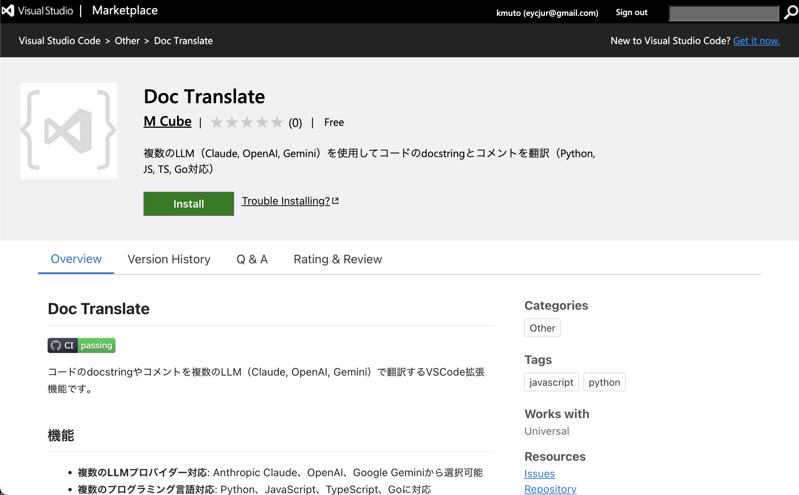

<!-- _class: cover -->
<!-- _paginate: false -->

# Doc Translate
##### LLMを活用したコードドキュメント自動翻訳VSCode拡張機能

2025年11月8日 開発組織のぷち改善ハッカソン！
pythonista

---

<style scoped>
.sns-icon {
  position: absolute;
  top: 150px;
  right: 850px;

  img {
  border-radius: 50%;
  }
}
.sns-qrcode {
  position: absolute;
  top: 490px;
  right: 650px;
}
</style>

## 自己紹介

<div class="column">
<div>

<p class="text-2xl">益居、光田、武藤</p>

<br>

株式会社ブレインパッド（OB含む）
　最近富士通に買収されることが発表されました

</div>
<div class="center">


<a href="https://gihyo.jp/book/2025/978-4-297-15100-3">#指南書本</a>
技術評論社（共著：武藤）

</div>
</div>

---

<!-- _class: toc -->

## 目次

1. [タイトル/課題](#課題認識)
2. [洞察/発見](#洞察/発見)
3. [Demo（アーキテクチャ/技術選定）](#システムアーキテクチャ)
4. [結果](#達成した成果)

---

<!-- _class: section_title -->

## タイトル/課題

---

## Doc Translate

LLMを活用したコードドキュメント自動翻訳VSCode拡張機能

<div class="center">



</div>

---

<!-- _class: leading-tight -->

## 課題認識

### 社内のコードベースにおける認知負荷

社内で、英語と日本語のコメントが混在していたり、英語のみだったりするため、**認知負荷が高い**ことが問題でした。

また、OSSのドキュメントやコメントも英語で書かれているため、同様の課題がありました。

- コードを読む際に言語切り替えが発生
- 理解速度が低下
- レビュー効率の悪化

---

<!-- _class: section_title -->

## 洞察/発見

---

<!-- _class: leading-tight -->

## 開発過程で得られた洞察

### 1. Overlayでの表示 + カーソル時のみ原文表示

ホバーではなく、**overlay**で翻訳を表示し、カーソルがある時だけ原文を表示することで**読みやすさが劇的に向上**しました。

### 2. LSPを使うと言語ごとのパーサーが不要

Language Server Protocolを活用することで、各プログラミング言語のパーサーを自作する必要がなくなり、開発が大幅に効率化されました。

### 3. Vibeコーディングは楽しい

AIに開発させて、お菓子食べながら楽しくできる。

---

<!-- _class: section_title -->

## Demo（アーキテクチャ/技術選定）

---

<!-- _class: full_screen -->

# <!--fit--> Doc Translate デモ

---

<!-- _class: leading-tight -->

## システムアーキテクチャ

<div class="center">



</div>

---

<!-- _class: leading-tight -->

## 技術選定とその理由

### LLMプロバイダー

- **Anthropic Claude (デフォルト: Haiku 4.5):**
  高速・低コスト・高品質

- **OpenAI (デフォルト: GPT-4o-mini):**
  広く使われている標準的な選択肢

- **Google Gemini (デフォルト: 2.0 Flash):**
  新興プロバイダー、高速レスポンス

---

<!-- _class: leading-tight -->

## 主要機能の実装

### 1. インライン翻訳表示（2種類）

**コメント:** after decoration で行末に表示
```python
# Original comment  →  # 翻訳されたコメント
```

**Docstring:** opacity: 0 で原文を隠し、before で翻訳を表示
```python
"""Original docstring""" → 翻訳されたdocstring
```

**カーソル時原文表示:**
選択範囲と重なるdecorationを自動除外

---

<!-- _class: leading-tight -->

## 主要機能の実装

### 2. バックグラウンド事前翻訳

- ファイルオープン/保存/タブ切り替え時に自動実行
- キャッシュベース（なければ翻訳、あればスキップ）
- 並列翻訳（最大5並列）でパフォーマンス最適化
- Progressive translation（完了したブロックから順次表示）

### 3. 永続化キャッシュ

- SHA-256ハッシュベース
- VSCode globalState に自動保存
- 拡張機能再起動後も保持

---

<!-- _class: section_title -->

## 結果

---

## Doc Translateで検索してください！

<div class="center">



</div>

※`docTranslate.provider`、`docTranslate.<provider>ApiKey`の設定が必要です。

---

<!-- _class: full_screen -->

# <!--fit--> お菓子おいしかった🍪

 （ありがとうございます）

---

<!-- _class: back_cover -->

## Thank you!
